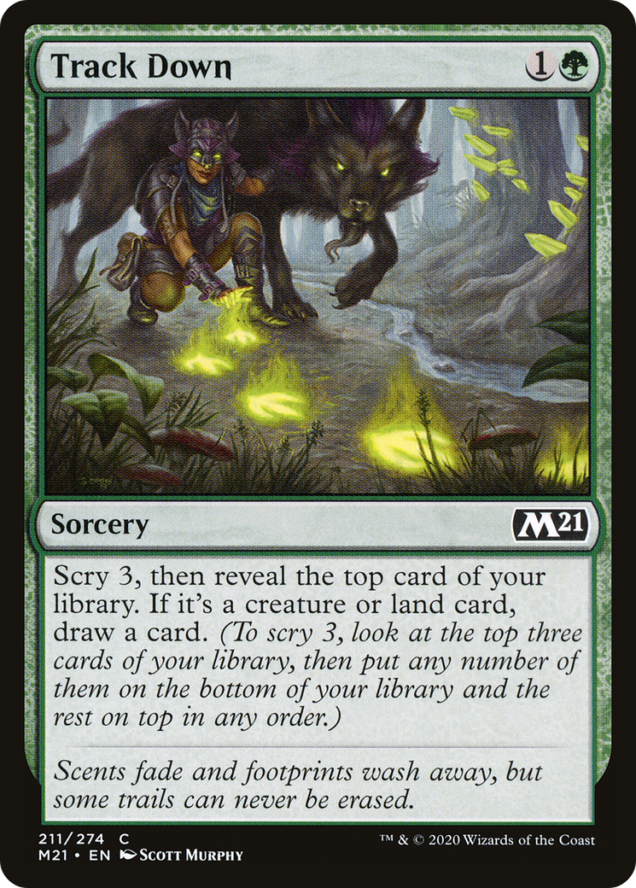

# Track Down (Core Set 2021)

## Vision

Two or more dark-furred wolves push through a shadowy woodland clearing, jaws open and teeth bared as they crest over mossy stones and roots. The lead wolf is mid-stride, eyes locked on prey out of frame to the right. In the foreground a chain of luminous yellow paw-prints glows on the leaf-strewn ground, marking a magical scent-trail the pack is following. The forest behind is dense with vertical trunks and tangled undergrowth in muted greens and browns; the only bright element is the supernatural yellow of the tracking spell.

**Subject:** A pack of wolves descending through a dim forest, following a glowing trail of paw-prints across the forest floor

**Composition:** scene, narrative, figures: duo, facing: right
**Setting:** forest, twilight, calm
**Foreground:** glowing yellow paw-print trail across leaf-littered forest floor; lead wolf snarling forward  *(palette: yellow, gold, brown, black)*
**Background:** dense dim forest with vertical tree trunks, mossy stones, tangled undergrowth  *(palette: dark-green, brown, black, olive)*
**Mood / lighting:** action, ambient
**Emotion read:** predatory focus, snarling aggression, the thrill of the hunt
**Objects:** glowing-paw-prints, moss, fallen-leaves
**Creatures:** wolf, wolf-pack
**Iconography:** paw-print, tracking-trail
**Genre cues:** fantasy

