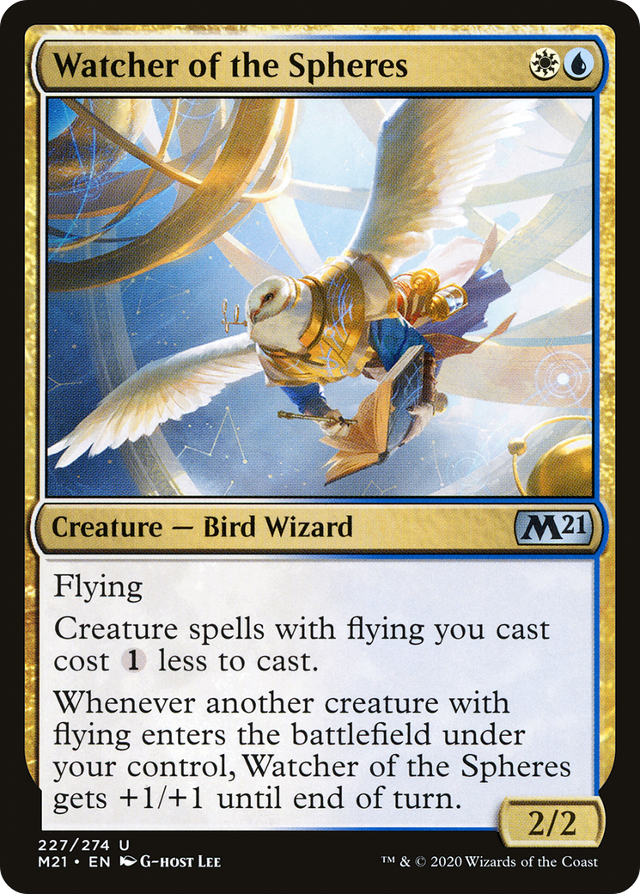

# Watcher of the Spheres (Core Set 2021)

## Vision

An anthropomorphic owl wizard with white plumage and large outstretched wings drifts in a sunlit sky, draped in voluminous gold-and-cream robes that catch the light. Its taloned hands hold or summon a luminous spherical light source at chest height; rays of warm light radiate outward, blending with pale clouds. The palette is dominated by soft gold, white, and sky blue, giving the figure an angelic, celestial-scholar feel. The composition is a mid-shot of a solo airborne figure, three-quarter view, with no other characters present.

**Subject:** An owl-like bird wizard with large white feathered wings, robed in flowing golden and white celestial garments, hovering in a bright sky while cradling or conjuring a glowing orb of light

**Composition:** mid-shot, portrait, figures: solo, facing: three-quarter
**Setting:** other, day, clear
**Foreground:** robed owl-wizard with outstretched wings holding a glowing orb  *(palette: white, gold, cream, warm-yellow)*
**Background:** bright sunlit sky with pale clouds and radiant celestial light  *(palette: sky-blue, white, pale-gold)*
**Mood / lighting:** sublime, backlit
**Emotion read:** serene, contemplative, vigilant — the watcher pose
**Objects:** glowing-orb, robes, sphere
**Creatures:** owl, bird-wizard, anthropomorphic-bird
**Iconography:** orb, wings, halo-of-light, sphere
**Genre cues:** fantasy, high-fantasy, celestial

