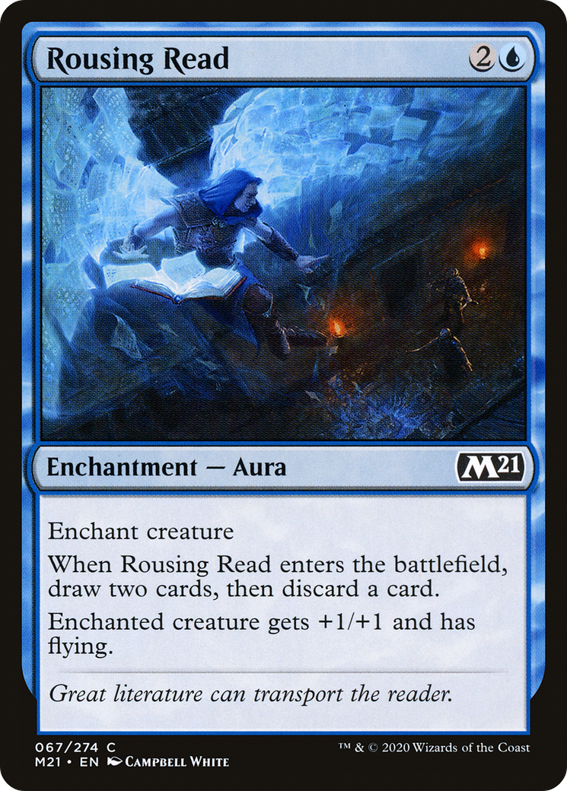

# Rousing Read (Core Set 2021)

## Vision

A solitary hooded, robed figure stands at center holding an open book. The tome glows from within, casting bright cool light up onto the reader's face and chest while loose pages or wisps of luminous energy spiral upward into the gloom. The surrounding chamber is rendered almost entirely in deep blues and blacks, with vague suggestions of architecture or shelves dissolving into shadow. The composition centers the reader as a small, vertical silhouette dwarfed by the dark space and the radiant aura of the book itself. Mood is hushed, scholarly, and softly mystical — knowledge as light in the dark.

**Subject:** A robed figure standing in a dim, blue-lit chamber, holding an open book that radiates magical light; luminous pages or energy swirl upward from the tome

**Composition:** mid-shot, narrative, figures: solo, facing: forward
**Setting:** indoor, indeterminate
**Foreground:** robed figure holding a glowing open book, luminous pages or energy rising from it  *(palette: cool white, pale blue, silver)*
**Background:** dark blue chamber dissolving into shadow, hints of vertical architecture or shelving  *(palette: deep blue, navy, black)*
**Mood / lighting:** peaceful, chiaroscuro
**Emotion read:** absorbed, quiet wonder; rapt attention
**Objects:** book, tome, glowing pages, robe
**Iconography:** glowing book, rising light, lone reader
**Genre cues:** fantasy, arcane

