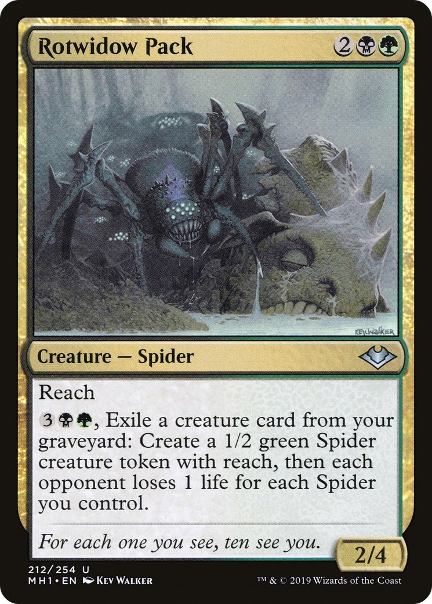

# Rotwidow Pack (Modern Horizons)

## Vision

A teeming cluster of huge, hairy spiders sprawls across the foreground of a sickly forest floor. The lead spider looms in front, its segmented legs and bristled body catching dim light, fangs and pedipalps prominent. Behind and beside it, more spiders pile and overlap in a writhing pack, half-buried in carpets of dead leaves, rotted bark, and broken twigs. The palette is muted green-yellow and brown, giving the scene a feverish, decayed quality. Background recedes into murky woodland with skeletal branches and shadowed undergrowth. The overall composition is dense, low-angle, and claustrophobic — a horror-of-nature swarm tableau.

**Subject:** A swarming pack of large, hairy spiders crawling across a rotting forest floor

**Composition:** wide, action, figures: group, facing: forward
**Setting:** forest, indeterminate, calm
**Foreground:** lead spider with hairy legs and visible fangs sprawling over rotted leaf litter  *(palette: bristled brown, ochre, muted olive, shadow black)*
**Background:** decayed forest floor receding into dark woodland with broken branches  *(palette: sickly green, mossy yellow, umber, deep shadow)*
**Mood / lighting:** horror, ambient
**Emotion read:** predatory, menacing, hungry
**Objects:** dead leaves, broken branches, rotted logs
**Creatures:** spider, giant-spider, swarm
**Genre cues:** fantasy, dark-fantasy, body-horror

