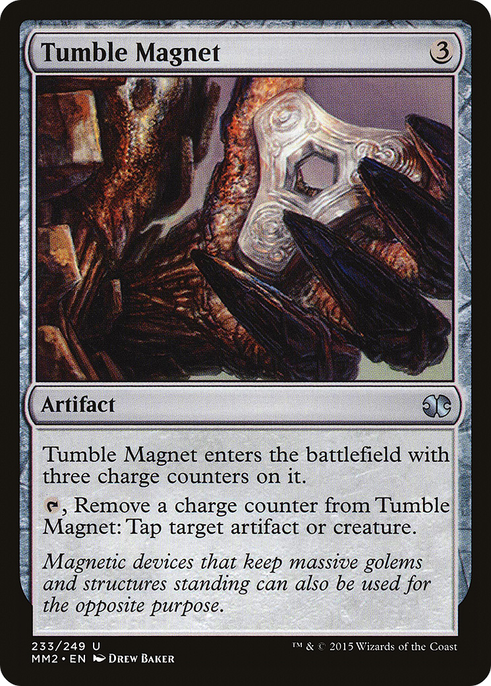

# Tumble Magnet (Modern Masters 2015)

## Vision

A close, static study of a magical metal device: three curved black-iron prongs or hook-blades emerge from a central node in a triangular arrangement, anchored to a chunk of rough grey stone. The artifact has the worn, battered look of a forged industrial tool — pitted metal, rounded edges, no ornament. Background is a dim, smoky grey-brown wash with no figures or scenery, focusing all attention on the object. The composition is centered and symmetrical, with the three arms of the magnet forming a near-perfect tripod silhouette. Lighting is soft and ambient, picking out the curve of the metal and the texture of the stone but casting no harsh shadows.

**Subject:** A three-pronged iron magnet device, with curved dark-metal blades or hooks radiating from a central hub, mounted on a rough stone base

**Composition:** close-up, abstract, figures: none, facing: n/a
**Setting:** other, indeterminate
**Foreground:** three-pronged iron magnet artifact mounted on grey stone  *(palette: black, dark-grey, iron-grey, stone-grey)*
**Background:** smoky grey-brown indeterminate wash  *(palette: smoky-grey, warm-brown, dim-ochre)*
**Mood / lighting:** other, ambient
**Emotion read:** inert, industrial, brooding stillness
**Objects:** magnet, iron-prongs, stone-base, forged-metal
**Iconography:** tripod-form, triangular-symmetry
**Genre cues:** fantasy, industrial-fantasy

