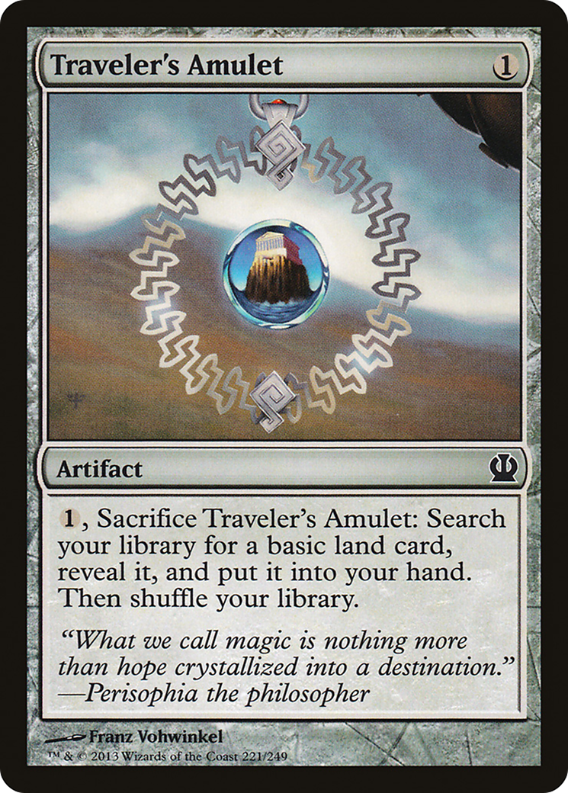

# Traveler's Amulet (Theros)

## Vision

A finely-wrought amulet hangs in the foreground, its centerpiece a luminous teal-blue cabochon stone framed by symmetrical filigree scrollwork in warm bronze or weathered gold. The pendant fills most of the frame, presented like a museum object. Behind it stretches a wide, hazy vista of arid hills and distant mountains under a pale, muted sky — a traveler's-eye view suggesting open country and long roads. The lighting is diffuse and atmospheric, giving the scene a sun-bleached, overcast quality.

**Subject:** An ornate metallic amulet or medallion with a glowing blue-green gemstone at its center, suspended in the foreground above a barren mountainous landscape

**Composition:** close-up, abstract, figures: none, facing: forward
**Setting:** mountain, day, calm
**Foreground:** ornate amulet with glowing blue gemstone and bronze/gold filigree  *(palette: bronze, gold, teal, cyan, aqua)*
**Background:** barren rolling hills and distant mountains beneath a hazy sky  *(palette: dusty-tan, muted-brown, pale-grey, soft-blue)*
**Mood / lighting:** peaceful, ambient
**Emotion read:** serene, contemplative — the stillness of a wayfarer's keepsake
**Objects:** amulet, medallion, gemstone, pendant, filigree, chain
**Iconography:** amulet, gemstone, talisman
**Genre cues:** fantasy, high-fantasy, mythic

