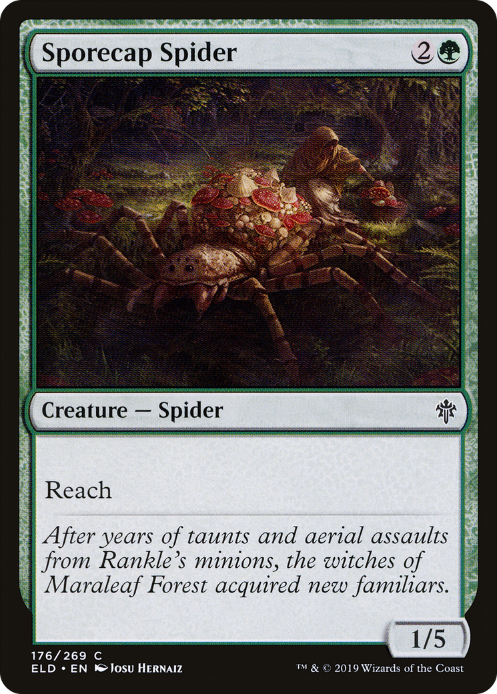

# Sporecap Spider (Throne of Eldraine)

## Vision

A large spider crouches in a moss-strewn forest clearing, its segmented body covered in pale mushroom caps. Skulls and broken armor litter the ground around it — the aftermath of a battle the spider seems to have won. In the misty background two cloaked, conical-hatted witch silhouettes are barely visible between trees. Palette is mossy greens and bruised browns; mood is grim and fairy-tale-dark.

**Subject:** A large green-grey spider crouched amid scattered armored corpses in a dim forest clearing; pale fungal caps grow on its back; two cloaked witches loom in the misty background

**Composition:** wide, scene, figures: group, facing: left
**Setting:** forest, indeterminate, fog
**Foreground:** A spider with mushroom-covered carapace amid scattered armored skeletons and skulls on a forest floor  *(palette: mossy-green, brown, ivory, grey)*
**Background:** Misty forest with two cloaked witch silhouettes wearing pointed hats  *(palette: dark-green, grey, black)*
**Mood / lighting:** grim, soft
**Emotion read:** predatory, watchful, sated
**Objects:** skull, armor, corpse, mushroom
**Creatures:** spider
**Genre cues:** fantasy, fairy-tale, painterly

