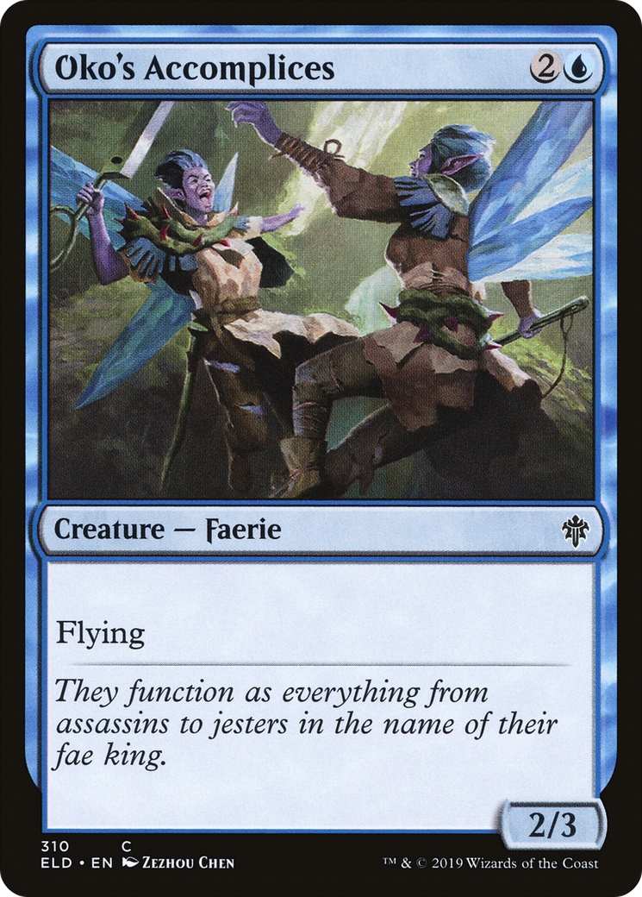

# Oko's Accomplices (Throne of Eldraine)

## Vision

Two slim faeries with iridescent wings and pale skin pose mid-air. The forward figure leans toward the viewer with a sly, knowing expression and a small dagger raised; the second figure hovers just behind in a more casual stance. Ornamental fae clothing of leaves and feathers; messy hair tossed by unseen wind. The palette is pale blues and lavender against a misty out-of-focus background. The vibe is mischievous, courtly-but-dangerous — flavor text reads they 'function as everything from assassins to jesters in the name of their fae king.'

**Subject:** Two faerie figures with translucent wings posing in a misty atmosphere, the foreground one bearing a small blade with a sly grin

**Composition:** mid-shot, portrait, figures: duo, facing: three-quarter
**Setting:** other, indeterminate, fog
**Foreground:** Two winged faeries with mischievous expressions, foreground figure raising a small dagger  *(palette: pale-blue, teal, lavender, ivory)*
**Background:** Soft misty atmospheric blue-purple haze  *(palette: blue, purple, grey)*
**Mood / lighting:** comedic, soft
**Emotion read:** mischievous, sly, threatening
**Objects:** dagger
**Creatures:** faerie
**Genre cues:** fantasy, fairy-tale, painterly

