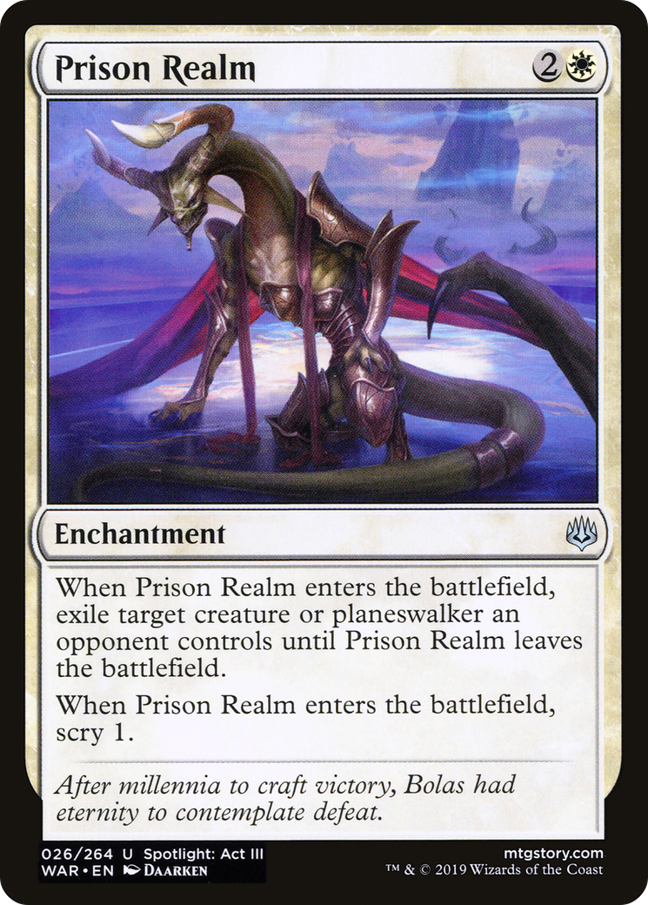

# Prison Realm (War of the Spark)

## Vision

> [!warning] Suspected IP: **Nicol Bolas (Magic: The Gathering)** (confidence: high, unverified)
> Reviewer: confirm whether the depicted figure is canonically this character. If yes, set `ip_verified: true` in frontmatter. If no, clear `suspected_ip`.

A horned, draconic humanoid figure with sweeping curved horns and dark wings is shown imprisoned at the center of the composition, head bowed in defeat or contemplation. The creature is enveloped in a swirling aura of violet, magenta, and pink magical energy with sharp white highlights radiating outward like cracks of light. Chains and crystalline shards extend across the frame, suggesting binding and confinement. The background fades into a deep purple-black void with hints of cosmic or otherworldly geometry. The lighting is harsh and dramatic, with the figure underlit and rim-lit by the prison's energy. Composition is centered and symmetrical, emphasizing the captive's helplessness and the totality of the magical cage.

**Subject:** A massive horned dragon-like figure bound and contained within a glowing magical prison, suspended in a void with chains and arcane energy radiating outward
**Suspected IP:** Nicol Bolas (Magic: The Gathering) (confidence: high, verified: False)

**Composition:** mid-shot, narrative, figures: solo, facing: forward
**Setting:** void, indeterminate
**Foreground:** bound horned dragon-figure in chains and crystalline restraints  *(palette: black, deep-violet, magenta, white)*
**Background:** void shot through with arcane purple-pink energy and shard-like geometry  *(palette: purple, magenta, black, white)*
**Mood / lighting:** grim, rim
**Emotion read:** defeated, head-bowed, resigned, contained
**Objects:** chains, crystal-shards, magical-aura, binding-runes
**Creatures:** dragon, horned-creature
**Iconography:** chains, prison, binding-magic, arcane-energy
**Genre cues:** fantasy, dark-fantasy

