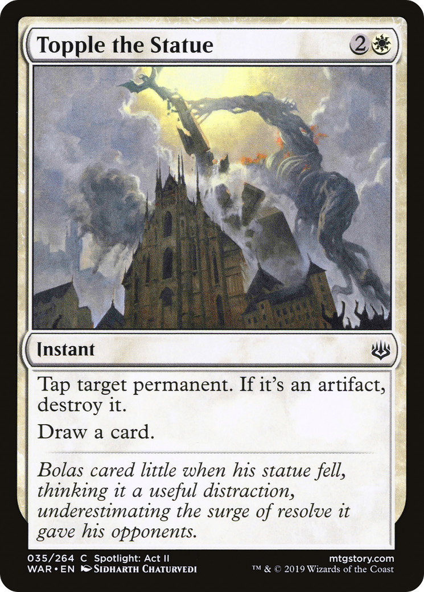

# Topple the Statue (War of the Spark)

## Vision

> [!warning] Suspected IP: **Nicol Bolas (Magic: The Gathering character — likely in-IP for this set, not external)** (confidence: med, unverified)
> Reviewer: confirm whether the depicted figure is canonically this character. If yes, set `ip_verified: true` in frontmatter. If no, clear `suspected_ip`.

An enormous stone statue depicting a horned, long-necked dragon-god figure pitches forward off its tall plinth, mid-collapse. The monument silhouettes nearly black against a churning, ash-gray sky streaked with paler clouds. The statue's twin curving horns and craning neck dominate the upper third of the frame, with chunks of masonry breaking loose as it falls. Below, a wide stone-paved plaza or courtyard recedes into haze, suggesting a ruined desert city. The palette is muted and monochromatic — slate grays, charcoal, and bone-white sky — giving the scene a grim, monumental, end-of-an-era feel.

**Subject:** A colossal stone statue of a horned dragon-god collapsing forward off its plinth
**Suspected IP:** Nicol Bolas (Magic: The Gathering character — likely in-IP for this set, not external) (confidence: med, verified: False)

**Composition:** wide, narrative, figures: none, facing: forward
**Setting:** urban, ruined, indeterminate, storm
**Foreground:** toppling colossal dragon-god statue on a stone plinth, paved plaza floor  *(palette: charcoal, slate-gray, stone-gray)*
**Background:** stormy overcast sky, hazy ruined cityscape on the horizon  *(palette: ash-gray, bone-white, pale-gray)*
**Mood / lighting:** grim, ambient
**Emotion read:** ominous, monumental collapse — the fall of a tyrant rendered in stone
**Objects:** statue, monument, plinth, rubble, paving-stones
**Iconography:** horns, dragon-god, fallen-idol
**Genre cues:** fantasy, epic, mythic

